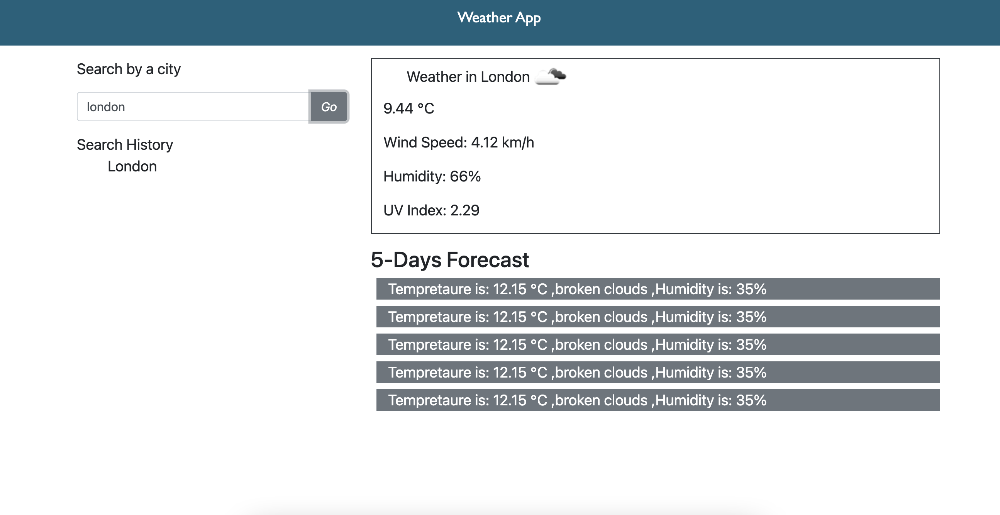

# Summary:
This is a weather dashboard that allows the user to search for a city. The weather will show the current and future conditions for the searched city. The search results will include the name of the city, the icon representing the weather conditions, the tempreature, the humidity, and wind speed and the UV Index. 

# Technologies used:
- HTML
- CSS
- Javascript

# Deployed links:

https://github.com/rayaalsaedi/Weather-app

https://rayaalsaedi.github.io/Weather-app/

 

 # Screenshot:

#
